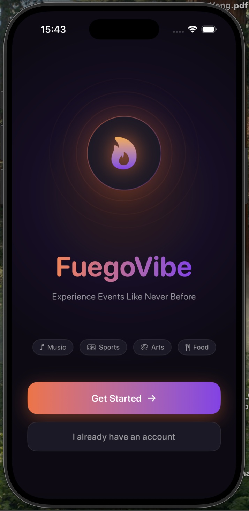
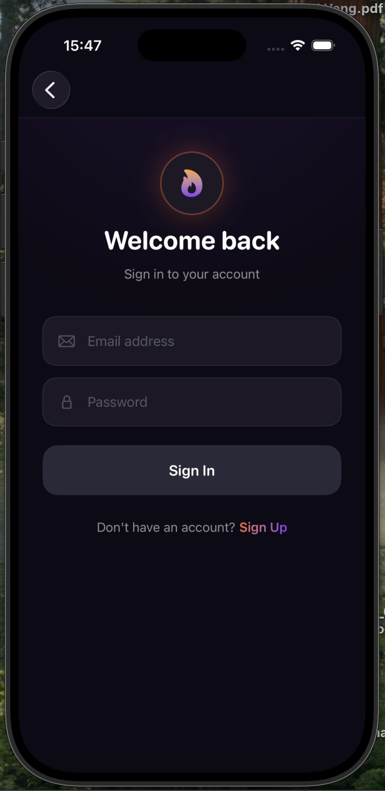
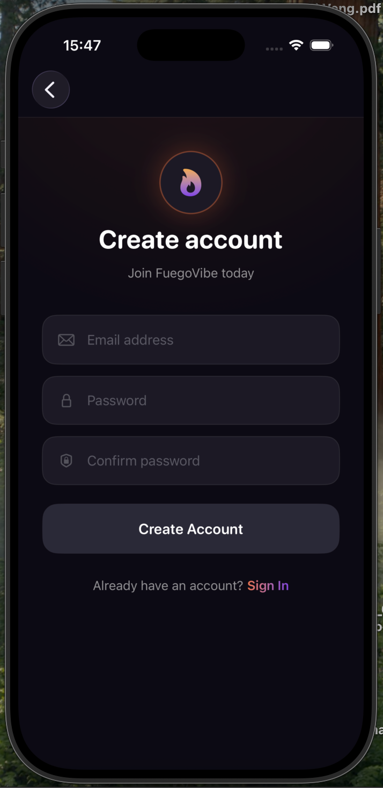
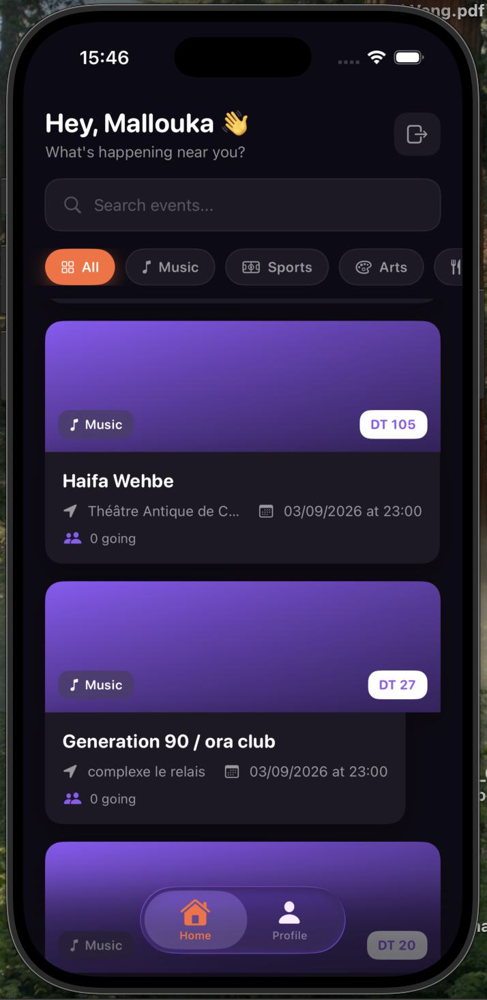
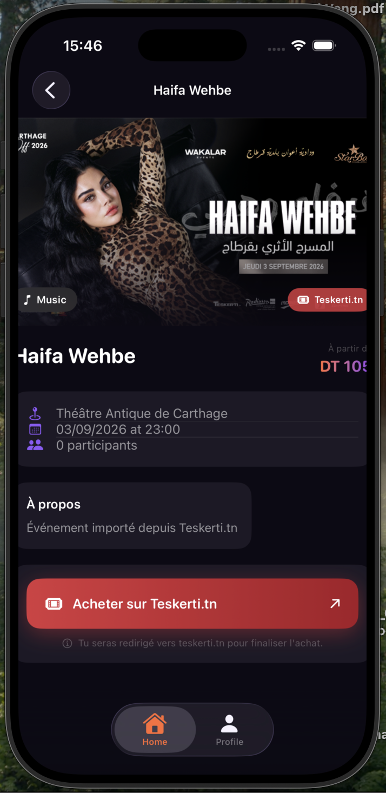
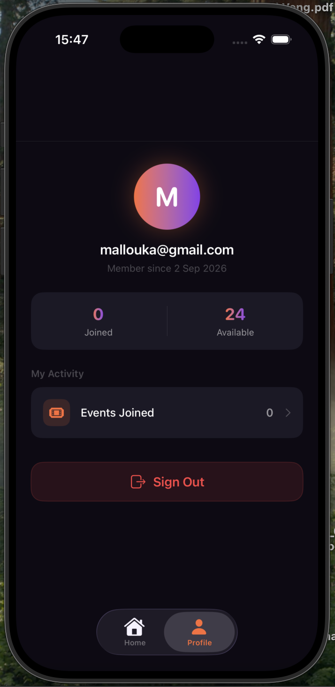
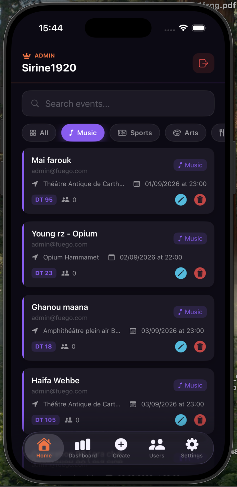
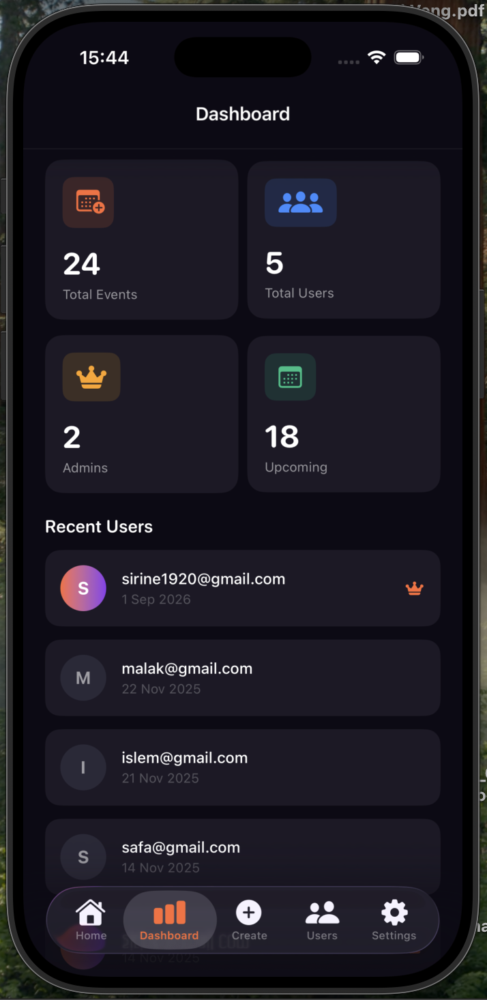
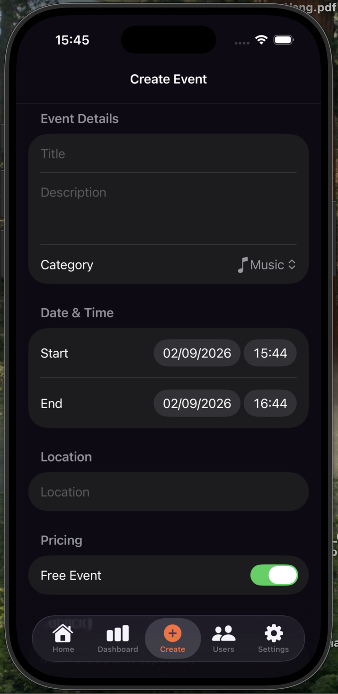

<div align="center">



# 🔥 FuegoVibe

**Experience Events Like Never Before**

[](https://swift.org)
[](https://developer.apple.com/swiftui/)
[](https://firebase.google.com)
[](https://developer.apple.com/ios/)
[](LICENSE)

[English](#-about) · [Français](#-à-propos)

</div>

---

## 📱 About

**FuegoVibe** is a production-ready iOS event management platform built with SwiftUI and Firebase. It aggregates real events from Tunisian ticketing platforms (Teskerti.tn, MonTicket.tn) and lets users browse, filter, and buy tickets — while admins manage everything from a dedicated dashboard with real-time sync.

---

## 📸 Screenshots

### User Experience

<div align="center">

| Welcome | Sign In | Sign Up | Home | Event Detail |
|:---:|:---:|:---:|:---:|:---:|
|  |  |  |  |  |
| Animated splash with fire logo | Dark auth with fire accent | Account creation | Personalized greeting + event feed | Real image + Teskerti buy button |

</div>

### Admin Panel

<div align="center">

| Profile | Admin Home | Category Filter | Dashboard | Create Event |
|:---:|:---:|:---:|:---:|:---:|
|  |  |  |  |  |
| Stats + joined events | Event management | Category chips | Live stats | Full event form |

</div>

---

## ✨ Features

### For Users
- 🔐 Firebase email authentication
- 🎭 Browse events by category — Music, Sports, Arts, Food, Business, Technology
- 🔍 Real-time search across all events
- 🎫 One-tap ticket purchase → redirects to Teskerti.tn or MonTicket.tn
- 📅 Register and unregister for FuegoVibe native events
- 💬 Motivational quote splash screen on launch (cached daily)
- 👤 Profile with joined events stats

### For Admins 👑
- 📊 Live dashboard — Total Events, Users, Admins, Upcoming count
- ➕ Create, edit, delete events with full form
- 👥 User management panel with role display
- 🔎 Search & filter by category with color-coded chips
- 📡 Real-time Firestore listener — no manual refresh needed

### Data Import Pipeline 🤖
- Python scrapers for Teskerti.tn & MonTicket.tn
- Auto-deduplication via `sourceURL` unique key
- Smart French date parsing (DD Mois YYYY, DD/MM/YYYY)
- Category auto-mapping to FuegoVibe taxonomy
- Runs independently with Firebase Admin SDK

---

## 🛠️ Tech Stack

| Layer | Technology |
|---|---|
| **Language** | Swift 5.9 |
| **UI Framework** | SwiftUI 5.0 |
| **Architecture** | MVVM |
| **Database** | Firebase Firestore (real-time listeners) |
| **Authentication** | Firebase Authentication |
| **Async** | Swift Concurrency (`async/await`, `@MainActor`) |
| **State** | `@EnvironmentObject`, `@StateObject`, `@Published` |
| **Images** | `AsyncImage` (native) |
| **Import Scripts** | Python 3.13, `requests`, `beautifulsoup4`, `firebase-admin` |
| **Security** | Firestore Security Rules |

---

## 🏗️ Architecture

```
FuegoVibe/
├── Models/
│   ├── EventModel.swift        # Event, EventCategory, EventStatus
│   ├── UserModel.swift         # AppUser, UserRole
│   └── QuoteModel.swift        # Quote of the Day
│
├── ViewModels/                 # @MainActor, ObservableObject
│   ├── AuthViewModel.swift     # Auth state, sign in/up/out
│   ├── EventViewModel.swift    # CRUD, join/leave, Firestore listeners
│   ├── UserViewModel.swift     # User list (admin)
│   └── QuoteViewModel.swift    # Daily quote with UserDefaults cache
│
├── Views/
│   ├── WelcomeView.swift       # Animated fire logo, shimmer title
│   ├── SignInView.swift        # Dark auth form
│   ├── SignUpView.swift        # Registration with password match
│   ├── DashboardUserView.swift # Home, EventCard, EventDetail, Profile
│   ├── DashboardAdminView.swift# Admin panel, Stats, CRUD, Users
│   └── QuoteSplashView.swift   # Full-screen quote with particles
│
├── DesignSystem.swift          # FV tokens, shared UI components
│
└── scripts/                    # Python import scripts
    ├── teskerti_import.py
    └── monticket_import.py
```

---

## 🚀 Getting Started

### Prerequisites
- Xcode 15+
- iOS 17+ simulator or device
- A Firebase project

### 1. Clone

```bash
git clone https://github.com/Swiren6/FuegoVibe-IOS_App.git
cd FuegoVibe-IOS_App
```

### 2. Firebase Setup

1. Go to [console.firebase.google.com](https://console.firebase.google.com) → create a project
2. Enable **Firestore Database** and **Authentication** (Email/Password)
3. Download `GoogleService-Info.plist` → drag into `FuegoVibe/` in Xcode

### 3. Firestore Index

In Firebase Console → Firestore → **Indexes** → Add composite index:
- Collection: `events` · Field: `isPublic` ASC · Field: `startDate` ASC

### 4. Security Rules

Copy the contents of `firestore.rules` into Firebase Console → Firestore → **Rules** → Publish.

### 5. Build & Run

```
⌘ + R in Xcode
```

### 6. Set Admin Role

In Firebase Console → Firestore → `users` collection → your document → set `role` field to `"admin"`.

---

## 🤖 Import Real Events

```bash
# Install dependencies (once)
pip3 install requests beautifulsoup4 firebase-admin

# Download serviceAccountKey.json from Firebase Console
# Project Settings → Service Accounts → Generate new private key
# Place it in scripts/

# Import from Teskerti.tn (~20 events)
python3 scripts/teskerti_import.py

# Import from MonTicket.tn
python3 scripts/monticket_import.py
```

---

## 🔒 Security

- **Firestore Rules** enforce read/write access server-side
- Users cannot self-promote to admin (role field protected)
- Join/Leave operations limited to `participantIds`, `currentParticipants`, `updatedAt`
- `GoogleService-Info.plist` and `serviceAccountKey.json` excluded via `.gitignore`
- Firebase Admin SDK (import scripts) operates server-side only

---

## 📁 Asset Setup

After cloning, add screenshots to display in this README:

```
assets/
└── screenshots/
    ├── welcome.png
    ├── signin.png
    ├── signup.png
    ├── home_user.png
    ├── event_detail.png
    ├── profile.png
    ├── admin_home.png
    ├── admin_filter.png
    ├── dashboard.png
    └── create.png
```

---

## 🇫🇷 À propos

**FuegoVibe** est une application iOS complète de gestion d'événements développée avec SwiftUI et Firebase dans le cadre d'un **Projet de Fin d'Études (PFE)** à TEK-UP University, en stage chez Smartovate.

Elle agrège des événements réels depuis Teskerti.tn et MonTicket.tn via des scripts Python, et propose une expérience utilisateur soignée avec thème sombre, animations, et un panneau d'administration complet.

**Stack** : Swift 5.9 · SwiftUI · Firebase Firestore · Firebase Auth · MVVM · Python 3.13

---

<div align="center">

**👩‍💻 Sirine** — Fullstack Software Engineer · 

[](https://github.com/Swiren6)

<sub>Built with 🔥 </sub>

</div>